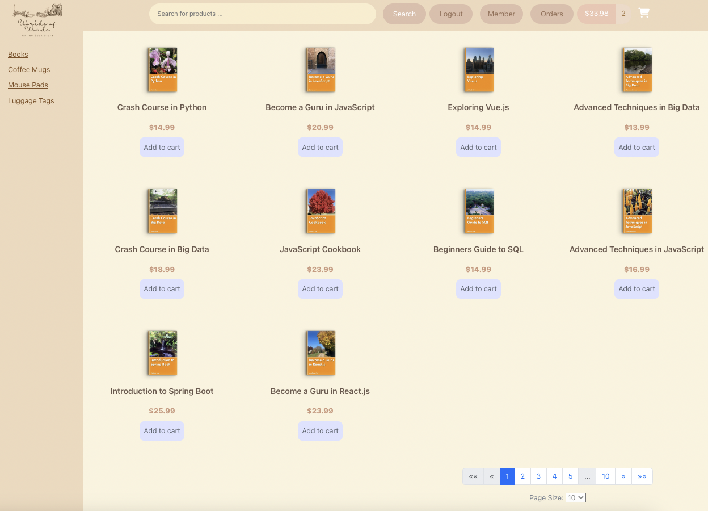
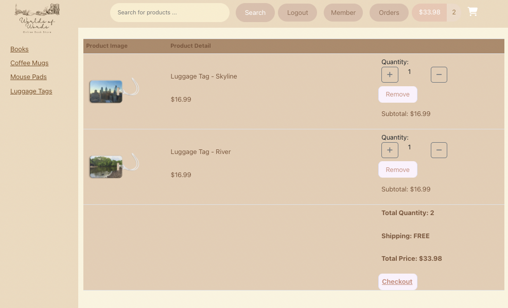
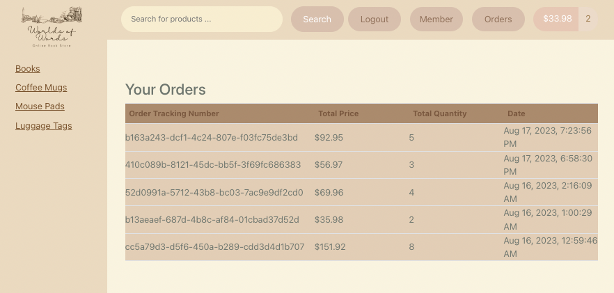
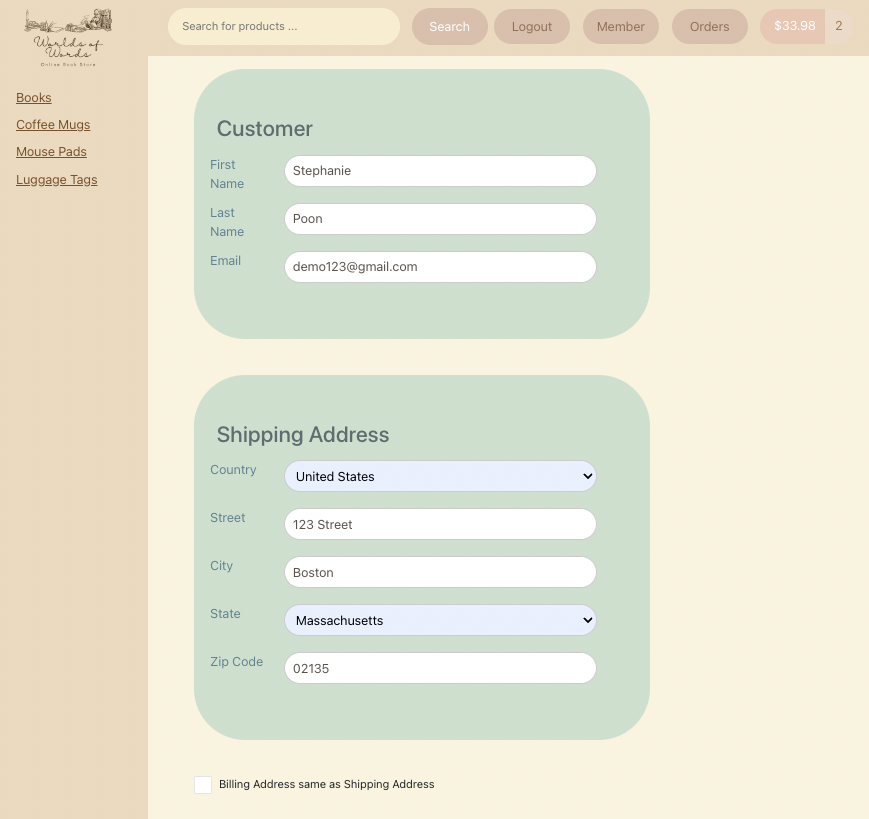

# World of Words - Online Book Store E-commerce

## Introduction
This is a full-stack website application for an online book store e-commerce, which allows customers to browse and purchase the products. This project demonstrates the ability to integrate Angular frontend, Spring Boot backend, and MySQL database.

## Features
### Create a Customer Account:
  * Easily register for an account to start shopping.
### Dynamic Page Size Adjustment:
  * Optimal viewing experience across devices, ensuring seamless browsing.
### Search for Products:
  * Find exactly what you're looking for with our robust search feature.
### Add Products to the Cart:
  * Select your desired products and add them to your cart with a simple click.
### Check Out the Shopping Cart:
  * Review your selected items and proceed to checkout for purchase.
  * The checkout form supports input validation as well as credit card validation.
### View Order History:
  * Keep track of your past purchases and view details at any time.
